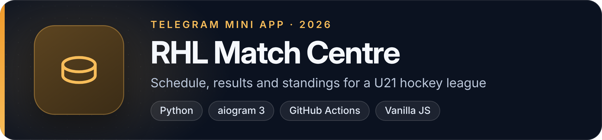
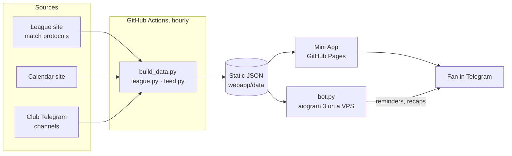

# RHL Match Centre

A Telegram Mini App and a companion bot for the **RHL, the Russian U21 hockey championship**, season 2026/27. The Mini App shows the schedule, results, standings and player stats for all 26 clubs. The bot sends match reminders and a short recap after the game.

The project started as a schedule bot for a single club, MHC Ryazan-VDV, and grew into an app for the whole league.

**Live app:** [arpicasso.github.io/bogdanov](https://arpicasso.github.io/bogdanov/) (interface in Russian)

## What it does

- **Matches, standings, calendar** for the whole league, with a fan profile that puts your club first
- **Match pages** built from the official protocols: score by period, goals, penalties, rosters
- **Head-to-head history** from five previous seasons
- **League leaders** in six categories
- **Home feed** that mixes the app's own cards with posts from club Telegram channels
- **Bot reminders** the evening before and on the morning of a game, plus a recap with the final score
- **Zveno**, a fantasy game on top of the league data (rules engine and prototype, in development)

## Architecture

There is no backend server for the app. A scheduled job turns public league pages into static JSON, and the Mini App is a static site that reads it.



- `league.py` downloads and parses match protocols, `build_data.py` assembles `league.json`, per-match files, head-to-head and leaders
- `webapp/` is plain HTML, CSS and JavaScript with no build step
- `bot.py` runs as a systemd service with long polling and keeps its state in JSON files
- `zveno/` is the fantasy rules engine, standard library only
- `tests/` holds about 300 `unittest` cases; fixtures are saved copies of real league pages

Design decisions are written down as ADRs in [`docs/adr/`](docs/adr), and the overall plan is in [`docs/ARCHITECTURE.md`](docs/ARCHITECTURE.md). Both are in Russian.

## My role

I own the product: what the app should do for fans, which data sources to trust, and the architecture decisions recorded in the ADRs. Most of the code was written with Claude Code as a coding agent, and changes land through pull requests that I merge.

## Stack

Python 3.11 · aiogram 3 · vanilla JavaScript · GitHub Actions · GitHub Pages · systemd · unittest

## How to run

```bash
git clone https://github.com/ArPicasso/bogdanov.git
cd bogdanov
python3 -m venv venv
venv/bin/pip install -r requirements.txt

venv/bin/python -m unittest discover -s tests    # tests
venv/bin/python league.py                        # download match protocols from the league site
venv/bin/python build_data.py                    # build webapp/data/ from them
cd webapp && python3 -m http.server 8000         # Mini App at localhost:8000
```

To run the bot you need a token from [@BotFather](https://t.me/BotFather):

```bash
BOT_TOKEN=... venv/bin/python bot.py
```

Deployment to a VPS is described in [`BOT_README.md`](BOT_README.md) (in Russian).
