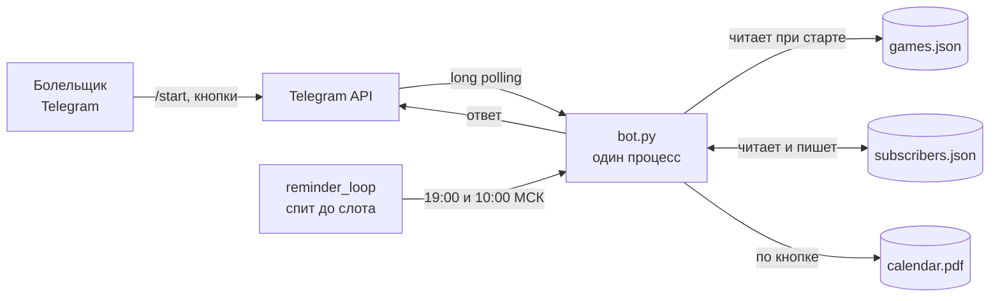
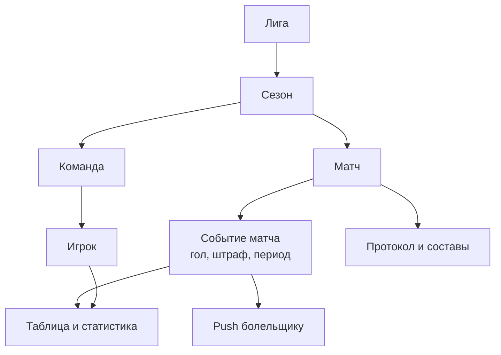
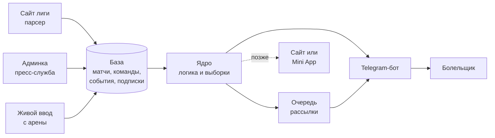
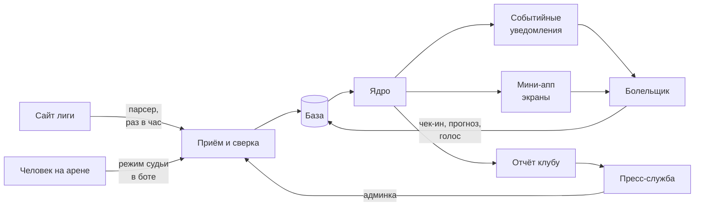
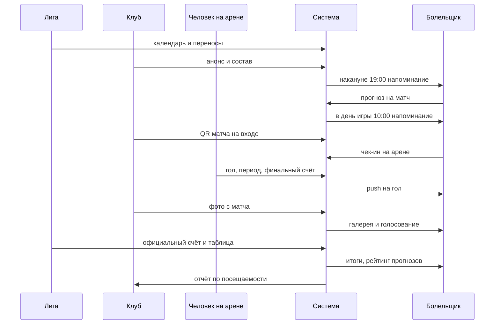

# МХК «Рязань-ВДВ»: карта системы и куда расти

> Рабочая копия живого документа. Обсуждение и правки идут там:
> https://claude.ai/code/artifact/b73460ae-abd0-4c96-9670-c62615e1ffa5
> Принятые решения переезжают сюда и в `docs/adr/`.

Состояние на 17 сентября 2026.

## Что есть сейчас

Один процесс на Python, который держит всё: и данные, и логику, и состояние. Это 319 строк на aiogram 3, без базы, без админки, без тестов. Для одного клуба работает, и это честная точка старта.

| Компонент | Чем является сейчас | Объём |
| --- | --- | --- |
| `bot.py` | Вся логика: хендлеры, форматирование, планировщик | 319 строк |
| `games.json` | Календарь сезона, правится руками в текстовом редакторе | 48 игр, 12 соперников |
| `subscribers.json` | Единственное состояние продукта: множество chat_id | файл на диске |
| `calendar.pdf` | Статичный файл, отдаётся по кнопке | 295 КБ |
| `ryazan-bot.service` | Автозапуск и перезапуск при падении | systemd |

Что умеет: следующая игра, ближайшие пять, весь сезон, разбивка по месяцам и по соперникам, домашние и выездные, плей-офф, PDF, напоминания. Десять кнопок и шесть команд.

Напоминания приходят накануне в 19:00 и в день игры в 10:00 по Москве. Считает их `reminder_loop` — вечный цикл в том же процессе, который спит до ближайшего слота.

Логика проверена вживую: сезон 03.10.2026 — 21.03.2027, 24 игры дома и 24 на выезде, дублей дат нет, склонения дней считаются верно. Бот поднят и проверен на раннере GitHub — до Telegram достучался, падений за 11 минут не было.

## Схема системы сейчас

В системе два независимых потока: ответ на нажатие кнопки и рассылка по таймеру. Оба живут в одном процессе и читают одни и те же файлы.

Читается так: календарь загружается в память один раз при старте, подписчики перезаписываются целиком при каждом переключении.

Здесь видны две вещи, важные для роста. Первая: чтобы поменять дату игры, нужен доступ к серверу и перезапуск процесса. Вторая: между ботом и данными нет ни одного слоя — хендлер сразу трогает файл.

## Где система упрётся

Ни одно из этих мест не мешает сейчас. Все они становятся проблемой на разных порогах роста, и порог важнее самой проблемы.

| Место | Когда взорвётся | Что именно сломается |
| --- | --- | --- |
| Календарь в файле | Первый же перенос игры | Правка требует SSH и перезапуска; никто кроме тебя не обновит |
| Состояние в JSON | ~1000 подписчиков | Файл переписывается целиком на каждое нажатие; при падении в момент записи — потеря всего файла |
| Рассылка в цикле | ~1500 подписчиков | При паузе 0,05 с рассылка растянется на минуты; падение посередине теряет хвост без следа |
| Один процесс | Второй клуб | Команда зашита в код и тексты; второй клуб = вторая копия всего |
| Нет админки | Появление второго человека | Ты единственная точка отказа для любой правки |
| Нет аналитики | Уже сейчас | Неизвестно, сколько людей и какими кнопками пользуются |
| Нет тестов | Первая правка чужими руками | Любое изменение проверяется только руками в Telegram |

Есть и один живой баг прямо сейчас: повторное нажатие на тот же месяц или соперника вызывает ошибку `message is not modified`. Кружок на кнопке зависает, потому что `c.answer()` до него не доходит.

Важное отсутствие проблемы: к долгой работе код готов. Часовой пояс прибит к Москве, DST в России нет, заблокировавшие бота вычищаются из подписчиков автоматически.

## Развилки

Архитектуру определяют не технологии, а ответы на эти четыре вопроса. Пока на них нет ответов, любой выбор базы или фреймворка — угадывание.

**1. Что значит «масштабировать».** Три разные системы прячутся за одним словом:

- Больше болельщиков одного клуба — нужна только база вместо JSON и очередь рассылки
- Много клубов РХЛ — нужна модель данных с командами, лигами и админкой
- Платформа для любого спорта — нужны изоляция клиентов, биллинг и самообслуживание

**2. Кто ведёт календарь.** Сейчас — ты руками в JSON. Дальше варианты: админка для пресс-службы клуба, парсер сайта лиги, импорт из таблицы. Это самый недооценённый вопрос: он решает, станет ли проект твоей второй работой навсегда.

**3. Зачем люди возвращаются.** Расписание смотрят раз в неделю. Счёт, составы, таблица лиги, билеты, трансляции, опросы — вот что даёт ежедневный возврат. От этого зависит, нужны ли внешние источники данных.

**4. Чей это проект.** Твоё хобби, проект клуба или продукт на продажу. От ответа зависят требования к надёжности, персональным данным и тому, кто чинит бота в субботу вечером.

Мой совет: начни с второго и третьего. Они про продукт, а не про код, и именно они чаще всего убивают такие проекты.

## Как работать вместе

Главная проблема работы с Claude — нет памяти между сессиями. Завтра он не вспомнит ни этот разговор, ни почему выбрано именно так. Лечится это одним: решения должны жить в репозитории, а не в переписке.

Три файла, которые меняют всё:

| Файл | Что в нём | Зачем |
| --- | --- | --- |
| `CLAUDE.md` | Правила проекта, стек, что нельзя трогать | Читается автоматически в каждой сессии |
| `docs/ARCHITECTURE.md` | Схема и потоки данных | Новая сессия начинает не с нуля |
| `docs/adr/NNN-*.md` | По одному файлу на решение: контекст, варианты, выбор, последствия | Через полгода понятно, почему так, а не иначе |

ADR — это запись архитектурного решения на одну страницу. Звучит бюрократично, но именно она отвечает на вопрос «почему здесь так странно» через год.

Порядок работы:

1. Сначала решение, потом код. Обсуждаем, фиксируем в ADR, только потом пишем
2. Одна сессия — одна задача. Длинные разговоры обо всём сразу размывают качество
3. Каждый кусок — отдельный PR, а не один большой коммит в конце
4. Тесты появляются вместе с первой же переписанной частью

## Что есть в приложениях КХЛ и МХЛ

Оба приложения построены вокруг матч-центра, а не вокруг расписания. Расписание там — всего лишь вход в карточку матча, где и живёт вся ценность.

| Функция | КХЛ | МХЛ |
| --- | --- | --- |
| Календарь матчей | есть | есть |
| Карточка матча: счёт, статистика онлайн, составы | есть | частично |
| Текстовые трансляции | есть | есть |
| Турнирная таблица | есть | есть |
| Статистика игроков и команд | есть, в реальном времени | есть, рейтинги игроков |
| Новостная лента | есть | есть |
| Избранная команда | до трёх | есть |
| Push на события матча | начало, гол, период, конец | есть |
| Видео: хайлайты и трансляции | есть, часть платная | не подтверждено |
| Фан-зона, арена, билеты | есть | не подтверждено |
| Иконка приложения с эмблемой клуба | есть | нет данных |

Самое важное наблюдение в строке про push. Они привязаны не к дате, а к событиям внутри матча. Именно это заставляет открывать приложение каждый игровой день, а не раз в неделю.

Оговорка про качество данных. Страницы App Store, RuStore и mhl.khl.ru открыть не удалось — всё закрыто egress-политикой. Таблица собрана по выдаче поиска, а не по самим приложениям. Перед тем как опираться на неё, стоит самому поставить оба приложения и пройти по экранам.

## Логика этих приложений

За всеми экранами лежит одна модель данных. Если повторять логику КХЛ и МХЛ, повторять надо её, а не набор кнопок.

Ключевая сущность здесь — **событие матча**. Из неё выводится всё остальное: текстовая трансляция — лента событий, push — реакция на событие, таблица и статистика — агрегат событий.

И здесь главное отличие от нас. Каждое событие вводит живой человек на арене — официальный статистик лиги, по регламенту, в течение матча. Приложение КХЛ — это витрина над операционной службой лиги, а не самостоятельный продукт.

Значит, вопрос не в том, как написать экран матч-центра. Вопрос в том, кто будет жать кнопку «гол» на матче в Рязани в среду вечером.

## Разрыв: чего не хватает

Из девяти ключевых блоков у нас есть один с половиной. Но важна не цифра, а последний столбец: он показывает, что упирается не в код, а в людей и данные.

| Блок | У нас сейчас | Что нужно, чтобы появилось |
| --- | --- | --- |
| Календарь | Есть, в файле | Источник обновлений вместо ручной правки |
| Напоминания о матче | Есть | — |
| Счёт и результат | Нет | Кто-то вводит счёт после матча |
| Турнирная таблица | Нет | Результаты всей лиги, не только наши |
| Состав команды | Нет | Список игроков от клуба и согласие на публикацию |
| Статистика игроков | Нет | События матча с авторами голов и передач |
| Текстовая трансляция | Нет | Человек на арене с телефоном весь матч |
| Push на гол | Нет | То же самое |
| Новости | Нет | Кто-то из клуба пишет |

Видна закономерность: почти везде в правом столбце стоит человек, а не технология. Код для таблицы или трансляции пишется за вечер. Поддерживать их живыми весь сезон — работа на каждый игровой день.

Есть и хорошая новость. По данным поиска, РХЛ — это переименованная в 2026 году НМХЛ, и живёт она на инфраструктуре МХЛ. Если лига публикует результаты и таблицу у себя, три строки из таблицы выше закрываются парсером без участия людей.

Это первое, что надо проверить руками: открыть сайт лиги и посмотреть, есть ли там страница нашего клуба со счётами.

## Целевая архитектура

Главное изменение против сегодняшней схемы — появляется три входа для данных вместо одного файла. Бот перестаёт быть всей системой и становится одним из клиентов.

Три решения, которые здесь зашиты, и почему именно так:

1. **База вместо JSON.** PostgreSQL или даже SQLite на первое время. Без неё невозможны ни события матча, ни статистика
2. **Очередь для рассылки.** Рассылка в цикле перестаёт работать на тысячах и теряет хвост при падении
3. **Ядро отдельно от бота.** Тогда сайт или Mini App добавляются без переписывания логики

Живой ввод с арены — это не отдельное приложение, а режим в том же боте для доверенных людей. Две кнопки «гол нашим» и «гол им» закрывают 80 процентов ценности текстовой трансляции.

Отдельное мобильное приложение в эту схему не входит сознательно. Магазины, ревью, обновления и две платформы — это цена, которая не окупается, пока аудитория меньше нескольких тысяч. Telegram Mini App даёт тот же экран матч-центра без этой цены.

## План по этапам

Порядок выбран по одному принципу: сначала то, что даёт данные для следующего шага. Строить матч-центр раньше этапа 2 бессмысленно — его нечем будет наполнять.

| Этап | Что делаем | Зачем |
| --- | --- | --- |
| 0. Гигиена | Баг с кнопкой, VPS, счётчики событий, CLAUDE.md | Без этого нет ни данных, ни почвы |
| 1. Разведка данных | Руками проверить, что лига публикует про наш клуб | Решает, нужен ли парсер или всё вводится руками |
| 2. База и ядро | Переезд с JSON на БД, модель матчей и событий | Фундамент для всего остального |
| 3. Результаты и таблица | Счёт после матча, положение в лиге | Первая причина заходить чаще раза в неделю |
| 4. Живой матч | Две кнопки для доверенного человека, push на гол | Главная фишка КХЛ, достижимая малой кровью |
| 5. Команда и составы | Игроки, номера, статистика бомбардиров | Требует согласия клуба на публикацию |
| 6. Второй клуб | Вынести команду из кода в конфиг | Только если первый взлетел |

Этапы 0 и 1 не требуют никаких архитектурных решений и делаются параллельно.

Развилка после этапа 1. Если лига публикует результаты — делаем парсер и этап 3 стоит почти ничего. Если нет — нужна админка и человек, который вводит счёт после каждой игры.

**Статус на 24.09.2026.** Этап 0: баг с кнопкой исправлен. Этап 1 пройден, результаты — в `docs/research/2026-09-24-stage1-data.md`. Развилка решена в пользу парсера: лига публикует полный протокол каждого матча. Оговорка — сайт РХЛ `rhl.fhr.ru` ещё закрыт, парсер пишется под движок старого `nmhl.fhr.ru` и проверяется, когда новый сайт откроется. Аудитория МХК — около 300 человек на домашнем матче, поэтому этап 2 можно не торопить.

**24.09.2026, разворот.** Строим под всю лигу и основным интерфейсом делаем мини-апп (ADR-002, ADR-003). Сделано: справочник 26 команд, календарь всей лиги (временно с r-hockey, помечен как предварительный), таблица по конференциям, мини-апп на GitHub Pages с экранами «Главная», «Календарь», «Таблица», «Команда» и карточкой матча. Дальше: подписки бота на любую команду, переезд календаря на `rhl.fhr.ru`, источник живого счёта.

**25.09.2026, запросы владельца продукта.** Три вещи, которые болельщик замечает первыми.
Идут по порядку, каждая — отдельный PR:

| Шаг | Что делаем | Решение | Статус |
| --- | --- | --- | --- |
| 1. Эмблемы всех клубов | Эмблемы 26 клубов вместо стикеров с аббревиатурой | — | сделано: 26 из 26. «Ахмат-Гранит», «Динамо-Карелия», «Калужские Ракеты», «Ростов» — из Википедии; «Витязь-Подольск», «Краснодар», «Красная машина Академия» — прислал владелец продукта |
| 2. История очных встреч | В карточке матча: победы, голы, пять последних игр, кто сильнее по истории | ADR-006 | сделано: `history.py` → `history.json` (1553 матча за 5 сезонов) → `webapp/data/h2h.json` → блок в карточке матча |
| 3. Составы на сезон | В «Я» под паспортом — состав любимой команды, лидеры, карточка игрока; составы соперников из карточки матча | ADR-007 | принято, ждёт `rhl.fhr.ru`: на нём составы 2026/27. Клубы предупреждены, статистику только по протоколам не показываем |
| 4. Статистика игроков по ходу сезона | Строка статистики каждого игрока обновляется после игрового дня, лидеры команды на «Главной» | ADR-007 | после шага 3 |
| 5. Лидеры лиги | «Таблица → Игроки»: топ-10 бомбардиров, снайперов, ассистентов, по +/−, вратарей и штрафу; лучший игрок своей команды за десяткой | ADR-009 | сделано по НМХЛ 2025/26, сезон 2026/27 подхватится после первого тура. В боте — `/leaders` и `?start=leaders`. Блокированных бросков лига не публикует |
| 6. Проводник и игроки в «Я» | Персонаж-стикер встречает и за 20 секунд показывает приложение; в «Я» — наши в лидерах, позже состав-стикербук, «Мой игрок», альбом сезона | ADR-010, ADR-011 | «в лидерах» в «Я» — сделано. Проводник — талисман своего клуба у каждой из 26 команд: встречает на выборе команды, ведёт тур, наклеен на паспорт (ADR-011). Остальное — после сайта РХЛ |

**25.09.2026, статус матча и источники.** Владелец спросил, можно ли показывать статус матча по
ходу игры, как вести статистику и где взять предсезонку, и попросил, чтобы данные всегда шли из
нескольких источников. У него есть письменное согласие Фонбета на окно матча и статистику, без
коэффициентов. Предложение — ADR-012: у матча стадия и статус; статистика в трёх слоях (живой,
официальный, предсезонка), которые не смешиваются; онлайн КХЛ — главный живой источник, Фонбет —
второй на условиях; опрос живых источников — с VPS в России. Разведка —
`docs/research/2026-09-25-live-status-sources.md`.

Этап 5 из таблицы выше («Команда и составы») этим закрывается без согласия клуба: состав и
статистику публикует лига, мы только показываем. Фото игроков по-прежнему не берём.

Чего в плане сознательно нет: видео, билетов, фантаси и мобильного приложения. Это три разных бизнеса сверх того, что мы строим.

## Чек-ин на матче

Болельщик отмечается на игре и накапливает историю посещений за сезон. Это единственная функция из всего списка, которая не зависит ни от данных лиги, ни от статистики — её можно делать сразу после базы.

Зачем это каждой из сторон:

- Болельщику — статус и история: «12 из 24 домашних», серия подряд, бейджи
- Клубу — первое в истории понимание, кто реально ходит, и база для розыгрышей среди пришедших

### Как подтверждать присутствие

| Способ | Как работает | Минус |
| --- | --- | --- |
| QR на арене | Один код на матч, меняется каждую игру, висит на входе | Код можно сфотографировать и переслать |
| Геолокация | Кнопка активна в радиусе арены в окне матча | Требует разрешения, легко подменяется |
| Код со сцены | Диктор называет слово в перерыве | Требует участия клуба каждый матч |

Начинать стоит с QR плюс окно времени: чек-ин открыт с часа до начала и до конца матча, один раз на человека. Защиту от пересылки кода делать не надо: цена обмана здесь нулевая, а сложность растёт быстро.

### Модель данных

| Таблица | Поля |
| --- | --- |
| `fan` | telegram_id, имя, дата регистрации, согласие на обработку |
| `checkin` | fan_id, game_id, время, способ подтверждения |
| `badge` | код, название, условие выдачи |
| `fan_badge` | fan_id, badge_id, когда выдан |

Уникальный индекс по паре fan_id и game_id закрывает повторные отметки на уровне базы.

### Бейджи на старт

Четырёх хватит: первый матч, пять матчей, три подряд, половина домашних за сезон. Правила хранить в базе, а не в коде: клуб захочет свои под акции.

### Что нужно от клуба

Распечатать QR и повесить на входе перед каждым домашним матчем. Одно действие в игровой день, но без него функция не работает. Это и есть главный риск фичи.

## Фото с матча

Галерея снимков после каждой домашней игры, привязанная к карточке матча. Люди ищут там себя и своих, и это даёт второй визит после матча, когда результат уже известен.

Связка с чек-ином получается сама собой: кто отметился на матче, тому приходит уведомление «фото с игры готовы». Две функции питают друг друга.

### Кто заливает

Только клуб, через тот же бот в режиме админа. Фотограф кидает альбом в чат с ботом, бот привязывает его к последнему матчу. Загрузку от болельщиков на первом этапе не делаем — это сразу модерация и чужие лица без согласия.

### Где хранить

Сами файлы — на серверах Telegram, у нас в базе только `file_id`. Это бесплатно, не требует диска на VPS и работает мгновенно внутри бота.

Ограничение, которое надо знать заранее: `file_id` действителен только для того же бота. При смене токена или переезде на другого бота галерея умрёт. Если фото важны как архив клуба — нужно своё хранилище и это отдельное решение.

### Модель данных

| Таблица | Поля |
| --- | --- |
| `photo` | game_id, file_id, порядок, кто загрузил, время, видимость |

Поле видимости нужно сразу: снять одно фото по просьбе человека должно быть делом одной команды, а не правки кода.

### Чего не делаем

Поиска по лицам не будет. Звучит заманчиво для «найди себя на трибуне», но это биометрия с отдельным регулированием и отдельными согласиями. Листание галереи решает ту же задачу без юридических последствий.

## Персональные данные

До этого момента бот хранил только chat_id и ничего личного. Чек-ин и фото меняют это: появляются история передвижений человека и его изображение.

Что заложить сразу, пока дешево:

- **Согласие при первом чек-ине**, а не при старте бота. Флаг и дата в таблице `fan`
- **Кнопка «удалить мои данные»** — чистит чек-ины и бейджи. Дешево сейчас, дорого потом
- **Геолокацию не хранить.** Проверили радиус — записали факт чек-ина, координаты выбросили
- **Страница политики** по команде `/privacy`: что собираем, зачем, как удалить

Отдельно про фото. Клуб молодёжный, на трибунах и на льду несовершеннолетние. Публикация снимков с узнаваемыми людьми — зона ответственности клуба, а не наша. Зафиксировать это стоит письменно до запуска галереи.

Это не юридическая консультация. Просто три технических решения, которые в архитектуре с нуля стоят ноль, а через год требуют миграций.

## Границы системы

Мы делаем не приложение лиги. Мы делаем **клубный канал для болельщика**, который собирает разрозненную информацию в одно место и возвращает клубу понимание своей аудитории. Это важное различие: у КХЛ есть штатная служба статистики, у клуба НМХЛ её нет, поэтому система должна работать на том, что есть.

Здесь же закрывается первая развилка из раздела выше. Раз цель — вся НМХЛ, а не один клуб, значит команда с первого дня живёт в данных, а не в коде. Рязань становится первым клиентом, а не единственным.

### SIPOC

| Элемент | Содержание |
| --- | --- |
| **Поставщики** | Лига (сайт НМХЛ/РХЛ), пресс-служба клуба, человек на арене, фотограф, сам болельщик |
| **Входы** | Календарь и переносы, счета, таблица, составы, события матча, фото, новости, подписки и чек-ины |
| **Процесс** | Собрать → сверить → сохранить → решить кому важно → доставить → показать → собрать отклик |
| **Выходы** | Напоминание, карточка матча, таблица, галерея, история посещений, отчёт клубу |
| **Потребители** | Болельщик (80% выходов), клуб (аналитика и контент), позже — другие клубы лиги |

### Что за границей

Не наша зона ответственности: проведение матчей, судейство, официальный протокол, продажа билетов, видеотрансляции, права на контент. Всё это либо у лиги, либо у клуба.

Мы трогаем только три вещи: сбор информации, её доставку и обратную связь от болельщика. Если в какой-то момент окажется, что мы ведём официальный протокол матча — граница пробита, и с этим придёт ответственность за достоверность.

## Откуда информация и куда течёт

У системы четыре источника, и они радикально разные по надёжности. Строить надо так, чтобы пропажа любого из них не ломала остальное.

| Источник | Что даёт | Как часто | Надёжность | Что делать, если пропал |
| --- | --- | --- | --- | --- |
| Сайт лиги | Календарь, счета, таблица | После каждого тура | Средняя: вёрстка меняется без предупреждения | Перейти на ручной ввод, парсер шлёт алерт |
| Пресс-служба клуба | Составы, новости, анонсы, фото | Несколько раз в неделю | Низкая: зависит от загрузки людей | Показывать прошлые данные, не пустоту |
| Человек на арене | События матча, счёт в моменте | Только домашние матчи | Низкая: один человек, может не прийти | Матч без трансляции, счёт постфактум |
| Сам болельщик | Подписки, чек-ины, прогнозы, голоса | Непрерывно | Высокая: наша система | — |

Закономерность видна сразу: **чем ценнее данные, тем ненадёжнее их источник**. Самое стабильное — то, что даёт сам болельщик. Именно поэтому чек-ин, прогнозы и голосования — не украшение, а фундамент: они работают даже в неделю, когда лига молчит, а пресс-служба в отпуске.

### Куда течёт

Две вещи в этой схеме стоят специально.

Первая — **узел сверки** между источниками и базой. Счёт придёт дважды: от человека на арене сразу и с сайта лиги позже. Они будут расходиться, и правило разрешения конфликта нужно задать до разработки: лига всегда права, живой ввод — предварительный.

Вторая — **отчёт клубу** как полноценный выход, а не побочный эффект. Клуб отдаёт нам труд пресс-службы и человека на арене. Если взамен он не получает ничего осязаемого, через месяц QR перестанет появляться на входе.

## Игровой день по ролям

Вся система — это один цикл, повторяющийся 48 раз за сезон. Если этот цикл проходит без срывов, продукт работает. Всё остальное — надстройка.

### Точки передачи, где всё ломается

Каждая стрелка от человека к системе — это точка отказа. Их ровно четыре, и для каждой нужен запасной вариант.

| Передача | Что если не случится | Запасной вариант |
| --- | --- | --- |
| Клуб → анонс и состав | Карточка матча полупустая | Автоафиша из календаря |
| Клуб → QR на входе | Чек-ина нет вообще | Геолокация как запасной способ |
| Арена → события матча | Нет push на гол, нет трансляции | Счёт с сайта лиги на следующее утро |
| Клуб → фото | Галерея пустая | Раздел просто не показывается |

Принцип один: **ни одна функция не должна ломать соседнюю**. Не пришёл человек на арену — матч всё равно закрывается счётом с сайта лиги, прогнозы считаются, рейтинг обновляется. Просто без push на гол.

### Сколько ручной работы в игровой день

Считаем честно, потому что именно это убивает такие системы на третий месяц:

- Повесить QR — 2 минуты
- Жать кнопки на матче — фоново, но человек привязан к игре
- Залить фото — 5 минут после матча
- Анонс и состав — 10 минут накануне

Итого около 20 минут человеческой работы на матч плюс присутствие на игре. За сезон это примерно 8 часов на 24 домашних матча. Если клуб не готов выделить это время — вся правая часть схемы отпадает, и остаётся расписание с парсером.

## Мини-апп и бот: кто что делает

Разделение одно и простое: **бот толкает, мини-апп показывает**. Бот умеет приходить сам и не умеет в сложный экран. Мини-апп умеет экран и не умеет приходить сам.

| Функция | Где живёт | Почему |
| --- | --- | --- |
| Напоминание о матче | Бот | Нужно прийти самому |
| Push на гол | Бот | То же |
| Следующая игра одной строкой | Бот | Быстрый ответ без открытия экрана |
| Живой ввод с арены | Бот | Две кнопки, нужна скорость, а не красота |
| Чек-ин по QR | Бот | QR ведёт на deep link, это одно действие |
| Карточка матча | Мини-апп | Счёт, составы, события на одном экране |
| Турнирная таблица | Мини-апп | В переписке таблица нечитаема |
| Календарь сезона | Мини-апп | Нужны фильтры и прокрутка |
| Галерея фото | Мини-апп | Листание сеткой |
| Профиль болельщика | Мини-апп | История посещений, бейджи, место в рейтинге |
| Прогнозы и рейтинг | Мини-апп | Выбор счёта и таблица лидеров |
| Голосование за игрока | Мини-апп | Карточки игроков с фото |
| Админка пресс-службы | Мини-апп | Формы и списки, тот же код |

### Экраны мини-аппа

Пять экранов, больше на старте не надо:

1. **Главный** — ближайший матч крупно, под ним последний результат и место в таблице
2. **Матч** — карточка: счёт, события, составы, фото, голосование
3. **Календарь** — весь сезон с фильтрами дом/выезд
4. **Таблица** — положение команд в лиге
5. **Я** — посещения, бейджи, мои прогнозы, настройки напоминаний

### Почему мини-апп, а не сайт

Авторизация уже есть: Telegram сам говорит, кто открыл экран. Без этого пришлось бы делать регистрацию и пароли — и потерять половину людей на первом же экране.

Плюс одна аудитория вместо двух: человек, получивший push на гол, открывает карточку матча в два касания, не выходя из мессенджера.

### Чего в мини-аппе не делаем

Чата болельщиков — в Telegram для этого есть группы. Новостной ленты — дублирует канал клуба. Оплаты и билетов — пока нет решения по четвёртой развилке, чей это проект.

## Что изучить до разработки

Девять вопросов. Ответы на 1, 2, 7, 8, 9 получены 24.09.2026 — см. `docs/research/2026-09-24-stage1-data.md`. Вопрос 3 измеряется на первых матчах сезона. Вопросы 4–6 — разговор с клубом, черновик письма в `docs/research/letter-to-club.md`.

| № | Вопрос | Как узнать | Что от него зависит |
| --- | --- | --- | --- |
| 1 | Публикует ли лига счета и таблицу | Открыть сайт, найти страницу клуба | Парсер или ручной ввод. Этапы 2 и 3 |
| 2 | В каком виде данные на сайте | Посмотреть исходный код страницы | Сложность парсера: JSON или вёрстка |
| 3 | Через сколько появляется счёт | Сравнить конец матча и появление на сайте | Нужен ли живой ввод вообще |
| 4 | Есть ли в клубе человек под это | Спросить напрямую | Вся правая часть схемы |
| 5 | Готов ли клуб вешать QR | Тот же разговор | Чек-ин и вся лояльность |
| 6 | Даст ли клуб составы и согласие на фото | Разговор плюс письменно | Этап 5, галерея, голосование |
| 7 | Сколько людей ходит на матчи | Спросить клуб или посчитать самому | Потолок аудитории, нужна ли очередь |
| 8 | Где болельщики сейчас | Найти группы клуба, посмотреть активность | Канал запуска и реалистичный потолок |
| 9 | Что уже есть у других клубов НМХЛ | Посмотреть 3-5 клубов лиги | Есть ли вообще рынок для второго клиента |

### С чего начать

Вопросы 1–3 закрываются за вечер с браузером и решают главную развилку — парсер или админка. Это разница в недели работы.

Вопросы 4–6 — один разговор с клубом. Этот разговор важнее всего кода, который мы напишем: он определяет, строим мы систему из схемы выше или умное расписание.

Вопросы 7–9 можно отложить, но не надолго. Если на матчи ходит 200 человек, разговоры про очереди и масштабирование теряют смысл.

### Чего не надо изучать сейчас

Выбор базы, фреймворка для мини-аппа, хостинга. Это решается за час после того, как станет ясно, что именно мы строим. Сейчас это угадывание, которое потом придётся переделывать.

## Источники

Разделы про КХЛ и МХЛ собраны по выдаче поиска от 17 сентября 2026 года. Сами страницы открыть не удалось: egress-политика сессии блокирует все внешние домены.

- [Приложение «МХЛ» в App Store](https://apps.apple.com/ru/app/mhl/id416318096)
- [Приложение «КХЛ» в App Store](https://apps.apple.com/ru/app/%D0%BA%D1%85%D0%BB/id455938766)
- [МХЛ в Google Play](https://play.google.com/store/apps/details?id=ru.inventos.apps.mhl)
- [КХЛ в RuStore](https://www.rustore.ru/catalog/app/ru.zennex.khl)
- [Официальный сайт МХЛ](https://mhl.khl.ru/)
- [Новость МХЛ о приложении](https://mhl.khl.ru/news/1/4209/)
- [Российская хоккейная лига в Википедии](https://ru.wikipedia.org/wiki/Российская_хоккейная_лига_(с_2026))
- [Кубок Регионов на сайте МХЛ](https://mhl.khl.ru/news/1/135671/)

Фэнтези по КХЛ существует на [Sports.ru](https://www.sports.ru/fantasy/hockey/tournament/107.html): 17 игроков, бюджет 20 000, не более 3 из одного клуба. Для МХЛ и РХЛ фэнтези не найдено. Требует пофамильной статистики, поэтому стоит после этапа 5.
