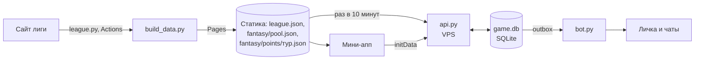

# ADR-013. Игры в мини-аппе: прогнозы, фэнтези и сервер под них

Статус: предложено, 25.09.2026 — запрос владельца продукта. Ждёт VPS в России (тот же, что в
ADR-012) и составов 2026/27 с `rhl.fhr.ru` (ADR-007). Пересматривает строку `docs/ARCHITECTURE.md`
«чего в плане сознательно нет: … фантаси».

## Контекст

Мини-апп показывает лигу, но повод открыть его есть только в день матча своей команды. Владелец
продукта предлагает «тяжёлую» функцию, ради которой заходят играть: фэнтези-команды с хорошей
логикой. Вопрос шире: какие игры вообще станут крючком и на какой инфраструктуре они живут.

Что есть на 25.09.2026:

- **Ритм сезона.** 48 матчей у команды с 3 октября по 21 марта. В 14 неделях из 25 у команды два
  матча, в остальных от одного до четырёх, часто два подряд с одним соперником. По лиге матчи
  идут каждый день недели
- **Аудитория.** Около 300 зрителей на домашнем матче, болеют родители, друзья и одноклассники
  игроков 16–19 лет. У каждой команды есть чат родителей, у игроков — чат раздевалки. Сами
  игроки — самая азартная часть аудитории
- **Данные.** Протокол лиги (ADR-001, ADR-008) даёт по каждому игроку в матче И, Ш, А, О, +/−,
  Штр, голы в равенстве, большинстве и меньшинстве, победные, броски в створ, вбрасывания. По
  вратарю — победу, броски, пропущенные, отражённые, «сухой» матч, время. **По каждому голу —
  номера всех, кто был на льду у обеих команд.** Сейчас `league.py` берёт не всё: нет +/−,
  бросков и игроков на льду
- **Сервера нет** (ADR-003). Всё, что мини-апп помнит о человеке, лежит на устройстве и в облаке
  Telegram. Общей таблицы игроков без сервера не сделать. VPS в России уже нужен для живых
  данных (ADR-012)

17.09.2026 фэнтези отложили, потому что не было пофамильной статистики и в проекте был один
клуб. Теперь есть вся лига, протоколы с полной статистикой (ADR-007, 008, 009), а фэнтези
бесплатное и без призовых денег, то есть не отдельный бизнес, а способ удержать аудиторию.

## Решение

### 1. Лестница игр, а не одна игра

Фэнтези глубокое, но узкое: состав собирает меньшинство. Нужны ступени от одного касания до
стратегии, на общей основе: вход через Telegram, очки из протокола, таблицы, лиги друзей.

| Ступень | Усилие | Как часто зовёт | Что нужно |
| --- | --- | --- | --- |
| **Прогноз на матч** | одно касание | каждый матч своей команды, ~2 в неделю | сервер, время начала (ADR-012, этап 2) |
| **Фэнтези «Моя пятёрка»** | 5 минут в неделю | тур раз в неделю плюс очки после каждого игрового дня | сервер, составы РХЛ |
| **Лиги в чатах и клубный зачёт** | ноль | итоги тура в чате каждую неделю | любая из двух игр выше |

Прогноз идёт первым: работает с первого тура, составы ему не нужны, и на нём проверяется сервер.

### 2. Прогноз на матч

- Выбор победителя (с овертаймом и буллитами) и, по желанию, точного счёта. Победитель — 1 очко,
  точный итоговый счёт — ещё 2
- Приём закрывается в момент начала матча. Время начала — из ADR-012, этап 2; без него прогноз
  не запускаем: закрывать в полночь значит отрезать утро дня матча, а бот зовёт в 10:00
- **«Болельщики за»** в карточке матча видят все, даже не игравшие: «64% за „Рязань-ВДВ“».
  Так игру находят без подсказок
- В напоминании бота накануне (19:00, время не меняется) — кнопка «Сделать прогноз»
- Очки — только по протоколу лиги. Живой счёт (ADR-012) показывает «пока угадываешь», но не
  начисляет

### 3. Фэнтези «Моя пятёрка»

Рабочее название: пятёрка и вратарь на льду, и заодно школьная пятёрка.

**Состав.** На льду 6: вратарь, 2 защитника, 3 нападающих. На скамейке 3: по одному на каждое
амплуа. Бюджет — не рубли, а условные единицы («шайбы»): цена в деньгах рядом с фамилией
несовершеннолетнего выглядит плохо. Не больше двух игроков из одного клуба, **из своего клуба —
до трёх**: так родитель всегда возьмёт своего сына, а болельщик — любимцев.

**Очки игрока за матч** (правила — `fantasy_rules.json` с номером версии, числа подгоняются на
протоколах НМХЛ 2025/26 до запуска):

| Полевые | Очки | Вратари | Очки |
| --- | --- | --- | --- |
| Сыграл | +1 | Сыграл | +1 |
| Гол нападающего / защитника | +3 / +4 | Победа | +3 |
| Передача | +2 | Отражённый бросок | +0,2 |
| Гол в меньшинстве, победный гол | +1 сверху | Пропущенная шайба | −1 |
| +/− | ±1 за единицу | «Сухой» матч | +4 |
| Бросок в створ | +0,5 | Гол, передача | как у полевых |
| Каждые 2 минуты штрафа | −1 | | |

**За матч у игрока не бывает меньше нуля.** Внутри формулы минусы есть, но рядом с фамилией
16-летнего не появится «−4». Списков «худших» не показываем нигде.

**Своя логика, которой нет у Sports.ru:**

1. **Бонус звена.** Гол, при котором на льду было двое или больше твоих игроков, даёт каждому из
   них +1. Протокол перечисляет всех на льду. Выигрывает тот, кто знает, кто с кем играет в
   тройке, а не тот, кто просто купил лидеров
2. **Двойные недели.** Тур — неделя с понедельника по воскресенье по Москве. У одних команд в
   туре 1 матч, у других 3–4. Смотреть в календарь выгодно
3. **Блокировка по игроку, а не всего состава.** Игрок блокируется в 00:00 МСК дня своего
   первого матча в туре и не меняется до конца тура. Остальных можно менять хоть в четверг. Для
   этого не нужно время начала, а зайти в приложение есть повод несколько раз за неделю.
   Когда время начала появится (ADR-012), блокировку можно сдвинуть на начало матча
4. **Автозамены.** Лига не публикует травмы и вызовы в МХЛ, поэтому игрок пропадает без
   предупреждения. Кто в туре не сыграл ни одного матча, того после тура заменяет игрок скамейки
   того же амплуа
5. **Капитан ×2**, вице-капитан получает ×2, если капитан в туре не сыграл
6. **Замены.** Одна бесплатная в тур, копится до двух, каждая лишняя — −4 очка
7. **Фишки**, каждая раз в полсезона: «Тройной капитан», «Скамейка играет», «Новый состав»
   (безлимит замен на тур)
8. **Цена — по форме, не по спросу.** Раз в неделю цена игрока сдвигается не больше чем на
   0,5 по среднему за последние 5 матчей. При сотнях участников спрос двигает один класс, который
   сговорился, а форма — честный сигнал. Стартовая цена — по прошлому сезону НМХЛ (id игрока на
   сайте лиги сквозной), у новичков — по амплуа

Сезон «Моей пятёрки» — регулярный чемпионат. Плей-офф — отдельным решением, там мало команд.

### 4. Социальный слой

Размер аудитории — не проблема, если играть с теми, кого знаешь. Поэтому главное здесь — не
общая таблица, а свои.

- **Лига друзей по ссылке** `t.me/<бот>/myapp?startapp=l_<код>`. Создать может любой, вступить —
  по ссылке. Тот же механизм, что приглашение в ADR-004
- **Лига чата.** Бот, добавленный в группу, раз в тур публикует таблицу лиги этого чата: чат
  родителей команды, класс, раздевалка. Бот толкает, мини-апп показывает (ADR-003)
- **Клубный зачёт.** Каждый играет за свой клуб из паспорта болельщика. Очки клуба за тур —
  среднее двадцати лучших его болельщиков, чтобы большие фан-базы не давили маленькие. 26 клубов
  соревнуются болельщиками, как командами на льду
- **Дуэль недели** — позже: в лиге друзей пары каждую неделю, как в очных встречах

### 5. Инфраструктура

Главный принцип: **факты статичны, личное — на сервере.** Всё, что одинаково для всех, считает
сборка на Actions и кладёт на Pages, как сейчас. На VPS — только то, что про конкретного человека.

**Статика, считает `build_data.py`:**
- `fantasy/pool.json` — игроки, амплуа, клуб, цена на тур, календарь туров и время блокировки
- `fantasy/points/<тур>.json` — очки каждого игрока за каждый матч с разбивкой («гол 3,
  передача 2, звено 1»). Очки — чистая функция протокола и версии правил. Лига поправила протокол
  — пересчитали, результат тот же при тех же входах. Проверяется тестами на тех же фикстурах
  протоколов, что `league.py`
- скрытые игроки (`hidden_players.json`) в пул не попадают. Скрыли по ходу сезона — игрок
  уходит из всех составов, замена бесплатная

**VPS, `api.py`** — `aiohttp.web`, он уже приходит вместе с aiogram. Отдельный systemd-сервис
рядом с `bot.py` и `live.py`, за nginx из ADR-012 (тот же домен, HTTPS, CORS для адреса Pages).

- **Вход** — заголовок `Authorization: tma <initData>`. Сервер проверяет подпись HMAC-SHA256
  ключом от `BOT_TOKEN` и свежесть `auth_date`. `initDataUnsafe` на сервере не используется:
  подделать его может кто угодно
- **Все правила — на сервере**: бюджет, лимит клуба, блокировки, дедлайны прогнозов. Время —
  только `ZoneInfo("Europe/Moscow")`. Клиент правила показывает, но не решает
- **База — SQLite в режиме WAL.** Для тысяч участников хватает с запасом. Миграции —
  пронумерованные SQL-файлы, применяются при старте. На Postgres переезжаем, когда появится
  второй сервер, не раньше
- **Составы хранятся снимками по турам**, а не только текущий: видно, кто кого взял и когда. Это
  история для игрока и ответ на любой спор
- **Очередь рассылки — таблица `outbox`**: API пишет «что отправить», бот отправляет и отмечает.
  Падение посередине ничего не теряет, и это закрывает «рассылку в цикле» из «Где система
  упрётся» без Redis
- **Право писать.** Бот может писать только тем, кто его запускал. При входе в игру мини-апп
  спрашивает `requestWriteAccess()`: «Присылать итоги тура?»
- **Счётчики событий** — таблица `event`: открыл экран, сделал прогноз, собрал состав, пришёл по
  приглашению. Без них не узнать, работает ли крючок. Это долг этапа 0 из `ARCHITECTURE.md`
- **Резервная копия** — раз в сутки `sqlite3 .backup`, зашифрованная копия вне VPS
- **Ни одна функция не ломает соседнюю.** VPS упал — мини-апп показывает всё, кроме игр, там
  «Игры временно недоступны, очки не пропадут». Actions задержался — прогнозы и составы
  принимаются, очки придут позже

**Персональные данные** (правило 4 `CLAUDE.md`):
- храним Telegram id, имя для таблиц (по умолчанию «Павел К.», можно сменить), клуб, дату
  согласия. Согласие — при первом действии в игре, а не при запуске
- **название команды — из готовых вариантов**, без свободного текста: таблицы видят школьники, а
  модерировать нам некем. Свободное название — позже и с фильтром
- «Удалить мои данные» в «Я» и `/privacy` в боте удаляют человека и все его строки
- всё, что приходит от сервера, в мини-апп — только через `esc()`

### 6. Как выглядит

Точный вид — правкой `DESIGN.md` до кода (правило 7). Главное: состав — стикеры игроков на
схеме площадки в форме своих клубов (ADR-009), это прямо «альбом, который хочется листать».
Вход — пятая вкладка «Игры» или раздел в «Я»: решаем вместе с макетом.

## Другие крючки по ценности

| Игра | Зачем | Что нужно | Когда |
| --- | --- | --- | --- |
| Викторина дня | Повод зайти в день без своего матча. Три вопроса по вчерашним протоколам («Кто забил победную у …?»), собирает `build_data.py` без редактора. Результат в чат: «РХЛ-квиз 3/3 🟩🟩🟩» | Ничего: живёт без сервера, серия дней в облаке Telegram | Можно до VPS |
| Альбом сезона с наградами | Наклейки из ADR-010 выдаются за игры: угадал счёт, собрал лучшую пятёрку тура, был на арене | Сервер, ADR-010 | После фэнтези |
| Уровень болельщика | Сквозной опыт за все действия, уровень на паспорте и в истории | Сервер | После первых двух игр |
| Чек-ин на арене | Редкая «золотая» наклейка только с арены, отчёт клубу | QR от клуба | После разговора с клубом |
| «Кто забьёт следующим» | Игра во время матча | Живые данные ADR-012 | После `live.py` |

## Этапы

Каждый этап — отдельный PR.

| № | Что | Зависит от |
| --- | --- | --- |
| 0 | VPS в России, домен, nginx, HTTPS | Владелец — тот же этап 0 ADR-012 |
| 1 | `league.py`: +/−, броски, игроки на льду при голе. Прогон НМХЛ 2025/26 через правила очков, подгонка чисел | Можно сейчас |
| 2 | `api.py`, `game.db`, вход по initData, `event`, `outbox`, удаление данных | 0 |
| 3 | Прогнозы и «болельщики за», кнопка в напоминании, клубный зачёт прогнозов | 2, время начала (ADR-012, этап 2) |
| 4 | Пул игроков и очки в `build_data.py`, тесты на фикстурах | 1, составы РХЛ (ADR-007) |
| 5 | «Моя пятёрка»: пробный тур с владельцем и знакомыми, потом для всех. Цель — с понедельника 2 ноября, ~20 туров до конца регулярки | 2, 4 |
| 6 | Лиги друзей и чатов, итоги тура в боте, фишки | 5 |
| 7 | Предварительные очки по ходу матча из живого слоя | ADR-012, этап 4 |

## Чего не делаем

- Денежных взносов, ставок, оплаты Telegram Stars за участие: аудитория — школьники, и это уже
  азартная игра. Призы — только от клубов (мерч, билеты) и только после разговора с юристом клуба
- Связки с букмекером в любом виде (ADR-012, пункт 6.4)
- Цен в рублях, минусовых очков за матч, списков худших игроков
- Свободного текста от пользователей, который видят другие
- Своих оценок игроков: очки — открытая формула из протокола, а не мнение редакции (ADR-008)
- Живых очков в итоговых таблицах: только протокол лиги (ADR-012, три слоя)

## Открытые вопросы владельцу

1. **VPS и домен** — тот же вопрос, что в ADR-012. Это единственное, что блокирует все игры
2. **Очки как оценка игроков.** ADR-008 запрещает свои оценки. Фэнтези-очки — открытая формула,
   но это всё равно рейтинг несовершеннолетних по матчу. Советую принять с правилами из пункта 3:
   не меньше нуля, без худших
3. **Могут ли играть сами игроки лиги.** Советую да: денег нет, а игроки приведут раздевалку
4. **Где вход** — пятая вкладка «Игры» или раздел в «Я»
5. **Призы от клубов** — нужны ли на старте. Советую без призов до конца первого сезона

## Последствия

- У проекта появляется сервер с базой и личными данными. Бэкапы, удаление данных и `/privacy`
  становятся обязательными
- В `CLAUDE.md` добавятся `api.py`, `game.db`, `fantasy_rules.json`, `migrations/`; в
  `requirements.txt` — ничего нового
- `docs/ARCHITECTURE.md`: строка «фантаси сознательно нет» меняется на ссылку на этот ADR, этап
  «База и ядро» делается не ради масштаба, а ради игр
- `league.json` не меняется, фэнтези живёт в своих файлах `webapp/data/fantasy/`
